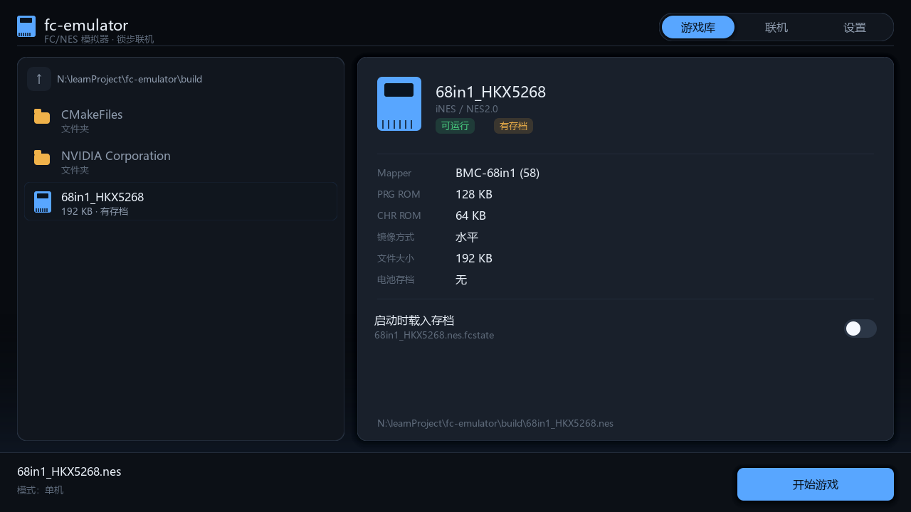
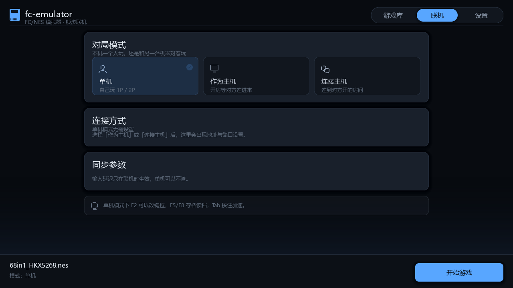
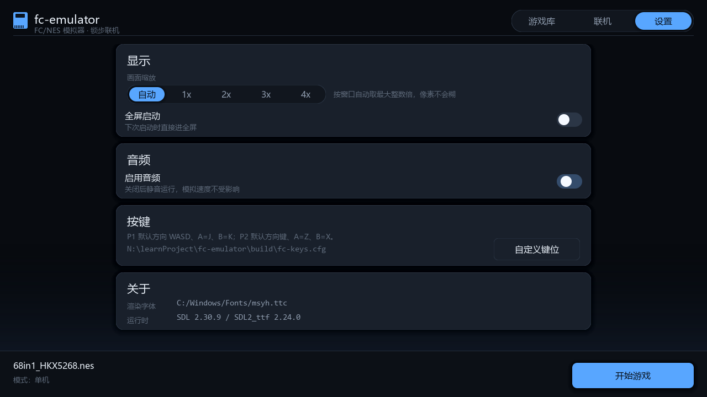
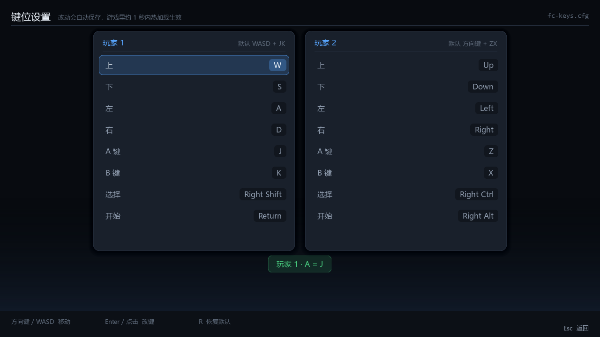
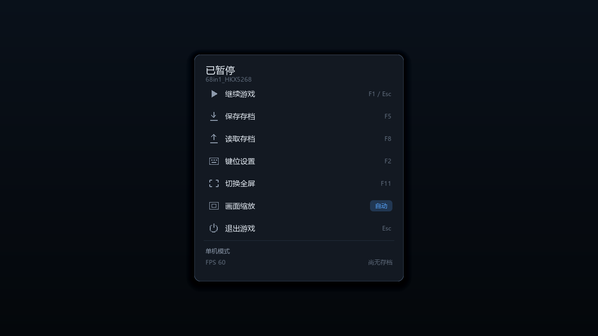

# fc-emulator

> ### 🤖 本项目 100% 由 AI 生成
>
> 全部源代码、构建脚本、测试工具与文档均由 AI 编写，**没有一行是人类手写的**。
> 人类负责提出需求、拍板技术选型、在真机上测试并报告缺陷。
>
> 读代码、复用它、或打算商用之前，请先看 **[NOTICE.md](NOTICE.md)** ——
> 里面写清了生成范围、人类参与的部分、许可证状况与已知的局限。

一台用 **C++17 + SDL2** 从零手写的 FC（NES / 红白机）模拟器，自带 **图形启动器**、
**游戏内暂停菜单**与 **UDP 帧同步联机对战**。

没有依赖任何现成的模拟器内核或第三方 CPU/PPU 库——6502 指令集、PPU 图形管线、
APU 音频、卡带 Mapper、网络同步协议全部是本项目自己的实现。
界面层同样是自写的（圆角、阴影、渐变、缓动、字体回退都是逐像素算出来的），
只借助 SDL2_ttf 拿到矢量字形。

不想读文档？**直接运行 `fc-emulator.exe`**，选好 ROM 点「开始游戏」即可。

---

## 1. 快速开始

### 前置条件

- CMake ≥ 3.15
- MinGW-w64 g++（或 MSVC）—— 需要 C++17
- SDL2 开发包 —— **不在仓库里**（二进制依赖，见下方说明）
- SDL2_ttf 开发包 —— **不在仓库里**（图形界面用，见下方说明）

> 两者都必须就位，`fc-emulator.exe` 才会被编译出来。缺 SDL2_ttf 时，
> 因为启动器与暂停菜单全靠矢量字体渲染，构建会整体降级为只出 `fc-headless`。

### 构建

```bash
cmake -S . -B build -G "MinGW Makefiles"
cmake --build build --parallel
```

产物：

| 产物 | 说明 |
|---|---|
| `build/fc-emulator.exe` | SDL2 图形前端（含图形启动器、暂停菜单、音频、手柄、联机） |
| `build/fc-headless.exe` | 无图形验证程序（跑帧、导出 PPM 截图、校验快照） |

SDL2 与 SDL2_ttf **都不在仓库里**（开发包解压后上百 MB，属于二进制依赖，
不该进版本库）。构建前先自己下好、解压到 `third_party/`：

```bash
mkdir -p third_party

# 1) SDL2 —— 窗口 / 渲染 / 音频 / 手柄 / 输入
#    官方发布页：https://github.com/libsdl-org/SDL/releases/tag/release-2.30.9
curl -LO https://github.com/libsdl-org/SDL/releases/download/release-2.30.9/SDL2-devel-2.30.9-mingw.tar.gz
tar -xzf SDL2-devel-2.30.9-mingw.tar.gz -C third_party
ls third_party/SDL2-2.30.9/x86_64-w64-mingw32/          # 应看到 include/ lib/ bin/

# 2) SDL2_ttf —— 图形界面的矢量字体（抗锯齿、中文）
#    官方发布页：https://github.com/libsdl-org/SDL_ttf/releases/tag/release-2.24.0
curl -LO https://github.com/libsdl-org/SDL_ttf/releases/download/release-2.24.0/SDL2_ttf-devel-2.24.0-mingw.tar.gz
tar -xzf SDL2_ttf-devel-2.24.0-mingw.tar.gz -C third_party
ls third_party/SDL2_ttf-2.24.0/x86_64-w64-mingw32/      # 应看到 include/ lib/ bin/
```

默认就在这两个位置查找（`CMakeLists.txt` 里的 `FC_SDL2_ROOT` 与 `FC_SDL2_TTF_ROOT`）。
放在别处也可以，用 `-DFC_SDL2_ROOT=` / `-DFC_SDL2_TTF_ROOT=` 指过去，
**根目录需含 `include/SDL2`（SDL2_ttf 的根目录还需含 `include/SDL2/SDL_ttf.h`）、`lib`、`bin`**：

```bash
cmake -S . -B build -G "MinGW Makefiles" \
    -DFC_SDL2_ROOT=<SDL2 根目录> \
    -DFC_SDL2_TTF_ROOT=<SDL2_ttf 根目录>
```

构建脚本会自动把 `SDL2.dll` 与 `SDL2_ttf.dll` 拷到输出目录，运行时不需要额外配 PATH。

> 找不到 **SDL2**（或 **SDL2_ttf**）时，构建会自动降级为只编译 `fc-headless`。
> 也就是说**没有图形依赖也能跑通全部确定性 / 联机测试**，只是没窗口。
>
> 选 SDL2_ttf 的 **2.24.0** 而不是更新的 2.8.x：2.24.0 是 SDL2 线的最后一版，
> 与项目用的 SDL2 2.30.9 同代；其 mingw 包里 freetype / harfbuzz 已静态链好，
> **运行时只需要 `SDL2_ttf.dll` 一个文件**，不用拖一堆依赖。

### 生成测试 ROM（可选）

仓库不带 ROM。用自带的脚本可以生成一个最小 NROM 测试卡带：

```bash
python tools/make_test_rom.py roms/test.nes
build/fc-headless.exe roms/test.nes 60 shot.ppm
```

画面应当是一片 **橙边白顶的方块网格**。

### 无头验证与「花屏」排查

`fc-headless` 除了跑帧 / 截图 / 校验快照，还带了一组专门用来定位花屏的诊断开关：

```
--dump-ppu              导出 nametable 瓦片编号、属性表、调色板，并打印若干瓦片
                        在「当前分页生效后」的真实 8x8 图案
--trace-ppu             追踪 $2006/$2007，打印一张「哪些显存格子被写过」的覆盖图，
                        外加覆盖统计与最早的写入序列
--pad <掩码>            每帧固定按住某键
                        （A=0x01 B=0x02 Select=0x04 Start=0x08 Up=0x10 Down=0x20 Left=0x40 Right=0x80）
--pad-at <帧>:<掩码>    从指定帧起改用该掩码，可重复多次以模拟完整按键序列
                        （进菜单 → 移动光标 → 启动游戏）
```

排查顺序很直接：

1. **先看显存与画面的关系**（`--dump-ppu`）。若画面忠实反映 nametable，说明 PPU 渲染没问题，
   问题出在游戏写入的显存内容上；若二者不一致，才是 PPU 的锅。
2. **再看写入覆盖图**（`--trace-ppu`）。大片格子标记「从未写过」，说明游戏的上传流程
   中途被打断——这类现象基本是**时序类** bug（例如强制消隐语义、`$2007` 自增、
   或 NMI 时序），而不是 Mapper 分页错误。
3. **最后比对瓦片图案**。只有当「当前读到的瓦片」和 ROM 里真实存在的瓦片对不上时，
   才去怀疑 CHR 分页 / 图案表选择。

`tools/dump_chr.py` 把卡带的每个 CHR bank 导出成一张瓦片图，便于做上面第 3 步的比对：

```bash
python tools/dump_chr.py roms/your-game.nes chr 3    # 生成 chr_chr0.png ... chr_chrN.png
```

---

## 2. 运行

### 图形启动器（推荐）

**不带任何参数**直接启动，会先进一个现代化图形启动器，所有常用设置都在里面点完再开始：

```bash
fc-emulator
```

三个页签（点顶栏切换，或用 `Tab` 循环、`Ctrl+1/2/3` 或 `F5/F6/F7` 直达）：

| 页签 | 干什么 |
|---|---|
| **游戏库** | 目录浏览 + ROM 列表（双击跑、拖拽 `.nes`/文件夹进窗口也行）；右侧详情卡显示 Mapper / PRG / CHR / 镜像方式 / 文件大小 / **是否已有存档**，以及「启动时载入存档」开关 |
| **联机** | 单机 / 作为主机 / 作为客机 三选一 → 直连或中继 → 填地址与房间号 → 拖**输入延迟**滑杆 |
| **设置** | 画面缩放（自动 / 1x–4x）、全屏启动、音频开关、键位文件与「自定义键位」入口、运行时信息 |







底栏左侧是当前选择摘要（ROM 名、模式、是否读档），右侧是「开始游戏」，`Esc` 退出启动器。

配置非法时（比如选了「作为主机」却没填地址）**按钮会直接置灰**，并在底栏把缺什么写出来 ——
不让你点了才发现失败。按 `Enter` 同样会被拦下，并弹一条同样的提示。

启动器里所做的选择会写进 **`<exe 目录>/fc-launcher.cfg`**（纯文本 `key=value`，可直接手改），
下次打开自动填回来。这个文件被 `.gitignore` 排除 —— 里面含本机路径，不该跟着仓库走。

> 想要脚本 / 批处理友好、或沿用老习惯，**给一个 ROM 参数就会跳过启动器直接进游戏**，
> 下一节的命令行用法完全不变。

### 直接指定 ROM（命令行）

```bash
# 单机
fc-emulator roms/your-game.nes

# 放大 4 倍启动
fc-emulator roms/your-game.nes --scale 4

# 联机 A：局域网，或主机有公网 IP（P2P 直连）
fc-emulator roms/your-game.nes --host 7777                    # 一方开房
fc-emulator roms/your-game.nes --connect 192.168.1.20:7777    # 另一方连接

# 联机 B：走自建中继，双方都不需要公网 IP、不用碰路由器（推荐）
fc-emulator roms/your-game.nes --relay 1.2.3.4:7777 --room 8848 --host
fc-emulator roms/your-game.nes --relay 1.2.3.4:7777 --room 8848 --connect
```

建立连接时会**立刻弹出窗口**，中央显示当前进度（`等待客机连接中…` / `正在连接主机…` /
`房间 8848 等待对端…`），下方三个跳动的圆点表示进行中。等待期间窗口是活的（不卡死），
按 **Esc** 可取消。（从启动器点「开始游戏」进来的走的是同一个等待界面。）

若等待超时（主机 2 分钟 / 客机 15 秒 / 中继注册 1 分钟）或被取消，不会退出，
而是**自动切回单机模式**继续玩。

### 全部命令行选项

```
（不给任何参数）          打开图形启动器

--host [端口]           作为主机开房（默认 7777）。中继模式下端口可省略
--connect <IP[:端口]>   连接主机（默认端口 7777）。中继模式下地址可省略
--relay <IP[:端口]>     改用中继服务器（默认端口 7777）
--room <房间号>         中继房间号，两端必须一致（默认 7777，最长 31 字符）
--delay <帧数>          输入延迟帧数，默认 3（中继模式默认 6）
--scale <n>             游戏画面放大倍数，默认按窗口自动取最大整数倍
                        （给 n 就是固定倍数，画面居中、四周留黑边）
--fullscreen            全屏启动
--no-audio              静音运行
--load-state <文件>     启动时先载入存档再开始（联机时两端都要带同一个档，见「存档 / 读档」）
--keys <文件>           指定键位配置文件（默认 <exe目录>/fc-keys.cfg）
--shot <界面> <文件.ppm> 开发者自测：离屏渲染某个界面并存图后退出
                        界面取值 launcher | netplay | settings | keys | pause
                        （界面全是像素级细节，靠读代码判断不了对错，必须能一键出图比对）
--fps-log <帧数>        开发者自测：跑满 N 帧后打印实测帧率并退出（验证单机/联机节拍是否一致）
--help                  显示帮助
```

`--shot` 输出的是 **PPM**，用仓库自带的脚本转 PNG（不依赖第三方库）：

```bash
build/fc-emulator.exe --shot launcher launcher.ppm
python tools/ppm2png.py launcher.ppm launcher.png
```

`--fps-log` 配合无窗口驱动就能在纯命令行下量帧率，是排查「联机速度不对」最直接的手段：

```bash
SDL_VIDEODRIVER=dummy ./fc-emulator.exe game.nes --no-audio --fps-log 600
# 实测帧率 : 600 帧 / 9.982 秒 = 60.11 FPS（单机）

SDL_VIDEODRIVER=dummy ./fc-emulator.exe game.nes --no-audio --connect 127.0.0.1:7831 \
    --delay 3 --fps-log 600
# 实测帧率 : 600 帧 / 9.982 秒 = 60.11 FPS（联机）   <-- 必须和单机基本一样
```

`--relay` 必须与 `--host`（坐 1P）或 `--connect`（坐 2P）之一同时使用，它只改变
「包怎么走」，不改变座位。中继模式下两端填的是**中继服务器的地址**，
`--host` 的端口参数和 `--connect` 的地址参数都会被忽略（并提示一次）。

### 按键

默认键位（也就是常说的「**WASD + JK**」）：

| 功能 | 玩家 1（默认） | 玩家 2（默认） |
|---|---|---|
| 方向 | **W A S D** | 方向键 |
| A | **J** | Z |
| B | **K** | X |
| Select | 右 Shift | 右 Ctrl |
| Start | 回车 | 右 Alt |

手柄自动识别（A / B / Start / Back / 十字键 / 左摇杆）。

#### 自定义键位（F2）

三个地方都能打开这张界面：**游戏里按 `F2`**、**暂停菜单里选「自定义键位」**、
或者**启动器 → 设置 → 自定义键位**。



左右两张卡片是 P1 / P2，每行一个动作，右侧把当前键名画成小胶囊。操作方式：

```
鼠标         点一行选中，再点一次进入绑定
方向键/WASD  移动光标        回车  开始绑定（此时按 Esc 取消）
左右         切换 P1 / P2     R    恢复默认键位
Esc / F2     返回上一级
```

改完退出时**自动写回配置文件**，下次启动依然生效。

配置文件默认在 **`<fc-emulator.exe 所在目录>/fc-keys.cfg`**，也可以用 `--keys <文件>` 指定。
它是纯文本，可以直接手改：**运行中保存即热加载**，约 1 秒内自动生效（联机中也生效，
因为键位只是「物理键 → 手柄位」的本地映射，改键不会影响两端同步）。
热加载会读进来后打印一行 `[键位] 检测到 ... 有改动，已热加载生效` 并列出新键位；

```ini
[P1]
P1.UP=W          # scancode 26
P1.A=J           # scancode 36
P1.SELECT=Right Shift   # scancode 229
```

- 键名用的是 **SDL 扫描码名**（`W` `J` `SPACE` `RETURN` `RIGHT SHIFT` `KP_1`…），大小写都认；
  行尾的 `# scancode N` 只是注释，但程序在键名无法识别时会拿它兜底，
  所以配置**永远不会因为名字写法而变化丢失**。
- 存的是**物理按键位置**而不是字符，因此不受输入法 / 键盘布局影响。
- 一个动作只能绑一个键：绑到本玩家已用过的键会提示 `ALREADY USED BY ...` 并拒绝；
  与另一个玩家重复则只提示 `(ALSO USED BY 2P)`，不拦截（联机时两端各自用自己那套，重复无妨）。

> **联机中不能打开这张界面。** 锁步同步下本机一停帧，对端就会一直等这一帧；
> 需要调整键位请先在单机模式下改好，再进联机。
> 联机时暂停菜单里这一项会显示为灰色并注明「联机中不可用」，
> 从启动器进入也一样 —— 按钮点不动，而不是点了之后才发现被拒。

**联机时的键位规则**：座位固定为 **主机 = 1P、客机 = 2P**，双方各自用**本机的 P1 键位**
控制自己那个角色。也就是说两台电脑上都可以直接用 `WASD + JK`，
「键位一致」并不会互相干扰 —— 每台机器只上传自己那一路输入。

> 同屏双人（单机）时才需要关心 P1/P2 冲突：默认的 `WASD+JK` 与 `方向键+Z/X` 完全不重叠。

### 暂停菜单

游戏里按 **`Esc`** 或 **`F1`** 唤出暂停菜单（再按一次、或点「继续」返回游戏）：



继续 / 存档 / 读档 / 自定义键位 / 切换全屏 / 切换缩放 / 退出，每一项都带快捷键提示。
**单机时它会真正暂停模拟**；**联机时它只是一层叠加层，模拟照常推进** ——
锁步一旦停住，对端会一直等这一帧直到超时。所以联机下面板靠右摆放、遮罩很轻，
让你还能看见左半边的游戏画面，同时「读档」「键位」两项被明确置灰。

> 这不是偷懒的实现细节，而是联机语义的要求：在联机里做「真暂停」等于把对端卡死。

### 存档 / 读档

| 快捷键 | 功能 |
|---|---|
| `F5` | 存档到 `<rom>.fcstate` |
| `F8` | 从存档读取 |
| `F11` | 切换全屏 |
| `Tab` | 按住加速（仅单机） |
| `Esc` / `F1` | 暂停菜单（退出请从菜单里选「退出」，或直接关窗口） |

两种模式下的行为**不一样，而且是有意设计的**：

| | 存档 `F5` | 读档 `F8` |
|---|---|---|
| 单机 | ✅ 可用 | ✅ 可用 |
| 联机 | ✅ 可用（只是把本机状态读出来写盘，不改变模拟） | ❌ **禁用**，会打印原因 |

**联机中为什么禁止读档**：锁步同步的前提是「两端在同一帧上状态逐位一致」。
单方面读档会让本机状态瞬间跳到另一条时间线，而对端无法跟着跳，
从此每帧都对不上，且没有任何办法自行收敛。所以直接拦住，
而不是让它去触发一次「不同步」告警。

#### 想「从某个进度接着联机」：用 `--load-state`

既然联机中不能读档，那想从存档继续联机就得**开局就带着档**：

```bash
# 1. 联机玩到某处，其中一方按 F5，得到 <rom>.fcstate（例如 game.nes.fcstate）
# 2. 把这份档发给对方（微信/网盘/任意方式），两人各自放好
# 3. 双方都带上同一个档开局，连接方式不变
fc-emulator game.nes --load-state resume.fcstate --host 7777
fc-emulator game.nes --load-state resume.fcstate --connect <对方IP>
#    走中继就再加 --relay <IP:端口> --room <房间号>
```

- 存档里包含**帧号**，所以读档后双方都从那一刻接着走，进度完全对齐。
- **两端必须用字节完全相同的 ROM 和存档**，否则一连上就会报不同步 —— 这是故意的，
  比让你玩到一半莫名其妙分叉要好。注意 ROM 比对的是**文件指纹**，
  同一款游戏的「有头/去头」两个版本也会被判为不一致。
- 档名可以不同（`--load-state` 自己指定路径），内容必须一致。
- **座位仍然按命令行决定**：`--host` 坐 1P、`--connect` 坐 2P。谁当主机不影响
  游戏状态是否同步，只影响谁控制哪个角色。想换边就交换谁用 `--host`。
- 读档失败会**直接报错退出**（退出码 3），不会静默地从开机状态起跑 ——
  后者只会让你在联机时看到莫名其妙的「不同步」。失败原因会写清楚：
  文件打不开 / 不是本模拟器的存档 / 旧版格式 / 与当前 ROM 不匹配。

> 状态格式已升级（魔数 `FCN2`，把 ROM 指纹也写进了快照）。
> **旧版 `FCN1` 的档不再兼容**，读取时会明确提示，重新 F5 存一次即可。
> 把 ROM 指纹并入快照有个额外好处：以前两端 ROM 不一致时，如果差异字节
> 恰好从未被执行，状态哈希会一直相同（实测翻转一字节跑 6000 帧都没被发现）；
> 现在这种差异在**第 0 帧**就会被抓到。

> **那能不能做成「联机中直接读档」？** 可以，但不是放开一个判断那么简单，需要一整套协调协议：
> 双方协商一个目标帧做**同帧屏障** → 把 `.fcstate`（约 260KB）分包传给对端或约定双方本地同档 →
> 读档后**重基线帧计数**（输入缓冲、延迟槽位全部要跟着重排）→ 再校验读档后第一帧的哈希一致。
> 成本比这套 `--load-state` 高一个量级，而 `--load-state` 已经覆盖了绝大多数真实需求
> （「从某个进度接着打」只需要在开局前带上档，不需要在游戏中随时跳）。

存档的正确性有自动化验证：`tools/test_savestate.cpp` 会把第 200 帧的状态写盘、
**换一个进程**读回来再跑到第 300 帧，要求沿途每个检查点的状态哈希与「没读档、一路跑下来」
逐位相同；读档进程还会先乱跑 137 帧制造一个完全不同的当前状态，
以此证明 `loadState` 是整体覆盖而不是依赖当前状态。

```bash
g++ -std=c++17 -O2 -Isrc -o build/test_savestate.exe tools/test_savestate.cpp \
    -Lbuild -lfc-core -lws2_32 -lwinmm
cd build
./test_savestate.exe 68in1_HKX5268.nes save s.fcstate   # 存档 + 打印 HASH@250/275/300
./test_savestate.exe 68in1_HKX5268.nes load s.fcstate   # 读档 + 打印同样的哈希
# 两次输出的哈希必须逐位相同
```

---

## 3. 联机怎么工作

### 架构：确定性锁步 + 输入延迟

两个客户端各自完整地跑一份模拟器，**网络上只传输入**（每帧 1 字节），不传画面。
所以带宽占用极低（每帧几十字节），但要求两边模拟完全确定：

```
第 N 帧： 本机玩家物理输入 --> 打包广播（含最近 16 帧冗余）
                   |
                   v
          等待 (N - delay) 帧的远端输入
                   |
                   v
     主机：P1 = 本机输入, P2 = 远端输入
     客机：P1 = 远端输入, P2 = 本机输入     <-- 镜像分配
                   |
                   v
       两端各自推进第 (N - delay) 帧，看到的 P1/P2 完全一致
```

- **确定性**：只要 ROM、Mapper、起始帧一致，两端每一步的 CPU/PPU/APU 状态必然一致。
  为此所有核心模块都禁用了浮点与未初始化内存参与模拟计算。
- **输入延迟 `delay`**：把「等待远端输入」的时间藏进延迟里，`delay` 越大越抗网络抖动，
  但手感越迟钝。局域网建议 `2~3`，公网建议 `4~6`。
- **抗丢包**：每个包携带最近 16 帧的输入，丢一个包不影响后续；等待期间还会低频重发。
- **帧率必须显式节流（单机/联机一视同仁）**：锁步只提供「**上限**」约束 ——
  本机不会跑到对端前面；它**不提供「节奏」约束**。两端一路跑下去时，对端第
  `N - delay` 帧的输入早就躺在本地缓冲区里了，`waitForRemote()` 立刻返回、根本不等，
  于是模拟就会以 CPU 能跑多快跑多快。**这就是「联机比单机快很多」的原因** ——
  曾经主循环里写着「联机时跳过节流，反正锁步会自行节流」，是错的。
  现在单机与联机共用同一个 `kFrameMs`（NTSC 帧周期 16.64ms）节拍器，
  实测两端都稳定在 `60.1 FPS`（`--fps-log` 可复现）。
  注意节拍点只推进「真正跑了一帧」的路径，等待远端输入的那些轮次不消耗帧预算，
  否则会越等越晚。
- **音频必须跟着节拍走**：APU 每帧产出 1/60 秒的样本，声卡按 1 倍速消费，
  正常时队列积压一直在「半帧」上下（≈8ms）。一旦模拟快于声卡，积压就会单调上涨 ——
  所以队列安全阀要按**实际设备采样率**算、而且要小（现在是 0.12 秒）。
  早先写成硬编码 0.4 秒，联机时积压会长期卡在那个上限，
  听到的是 0.4 秒前的声音、且大部分样本被丢弃，**听感就是「回音」**。
- **不同步检测**：每 120 帧交换一次状态哈希（FNV-1a 64 位，覆盖 CPU/PPU/APU/RAM/卡带），
  不一致会在标题栏（`[不同步@帧N]`）和终端报警一次，并打印该帧两端各自的哈希。

  哈希与输入**分开存放**在两个独立的环形缓冲里，这点很关键：输入槽是按 512 帧循环复用的，
  如果哈希和输入挤在同一个槽里，槽被复用时会出现「帧号已更新、哈希还是旧帧的」，
  比对就变成拿**新帧的哈希**去对 **512 帧前的旧哈希** —— 结果必然是每局都误报不同步。
  哈希条目自带帧号，复用时旧条目因帧号对不上而自动失效，从根上避免了这类误报。

  哈希里还包含 **ROM 文件指纹**（见「存档 / 读档」），所以「两端 ROM 不是同一个文件」
  这件事也走同一条检测通道：要么第 0 帧就报，要么永远不会发生。

  报警只在**新一次**不同步时打印（而不是每帧轮询 `desynced()`），否则同一处不一致会刷满终端。

### 座位：主机固定 1P、客机固定 2P

每端只上传**自己玩家那一路**输入（1 字节），落到哪个手柄由角色决定：

| 端 | 本机玩家输入 | 对端玩家输入 |
|---|---|---|
| 主机 `--host` | → **P1** | → P2 |
| 客机 `--connect` | → **P2** | → P1 |

两端填完后看到的 `P1` / `P2` 完全镜像，所以**状态哈希依然逐位一致**，不同步检测照常生效。
按键提示与窗口标题会标出你的座位（`主机 (1P)` / `客机 (2P)`）。

这样双人对战类游戏（`90 TANK`、`ROAD FIGHT`、`KUNG FU`、`LODE RUNNER` 等）两边各控一个角色即可。

### 公网互联：直连 vs 中继

握手是**客机主动发 HELLO 去找主机**，主机只是被动收包。约束只有一条：
**客机要能主动够到主机的地址**。由此有三种玩法：

| 方式 | 需要什么 | 适用 |
|---|---|---|
| 局域网直连 | 什么都不用配，客机填主机内网 IP | 同一个路由器下 |
| 公网直连 | 主机有公网 IPv4，或光猫桥接拨号 + 路由器映射 UDP 端口 | 主机不在 NAT 后 |
| **中继** | 一台有公网 IP 的服务器（项目自带 `fc-relay`） | **任何情况，含双方都在 NAT 后** |

两种直连方式都需要在主机放行 UDP 端口并做端口映射，且项目本身是 P2P、没有中继。
**如果双方都在家庭宽带后面（现在绝大多数情况），前两种都走不通，用中继。**

#### 中继是怎么工作的

中继是**透明**的——它不理解模拟器的同步协议，配对完成后只做一件事：
「收到 A 的包，原样发给 B」。所以模拟器侧的握手、锁步、状态哈希比对**一行都没改**。

```
主机端 ──┐                                    ┌── 客机端
         │  1) 都向中继注册同一个房间号         │
         ├────────────► fc-relay ◄─────────────┤
         │              （公网 UDP 7777）       │
         │  2) 中继把两端配对，互相转发所有包    │
         └────────────► 之后双方都以为「对端就是中继地址」 ◄──┘
```

关键在于**两端都是主动向外连**，因此各自的 NAT 都会为这条连接开一个回程口子，
双方**都不需要公网 IP、不需要端口映射、不需要碰路由器**。

#### 部署中继服务器

中继是独立小程序 `fc-relay`，不依赖模拟器核心，编译只需一条命令：

```bash
# 在公网服务器上（Linux / macOS 均可，无第三方依赖）
g++ -O2 -std=c++17 -o fc-relay relay.cpp -Isrc
./fc-relay 7777                    # 或 ./fc-relay --bind 0.0.0.0 --port 7777
```

需要把这些文件放到服务器上：`src/frontend/relay.cpp` 和 `src/net/relay_proto.h`
（保持目录结构，或者把 `-Isrc` 改成 `-I<relay_proto.h 所在目录的上一级>`）。
在本机也可以用 CMake 构建出 `fc-relay.exe`，先自己试跑一遍。

服务器侧只需**放行一个 UDP 端口**（不是 TCP）。启动后日志长这样：

```
[relay] fc-relay 已启动，监听 UDP 0.0.0.0:7777
[relay] 注意: 防火墙需放行 UDP 7777（不是 TCP）
[relay] 房间 8848: 已配对  1.2.3.4:51234 <-> 5.6.7.8:62001
[relay] 房间 8848: 开始中转（双方后续可见「已连接」）
[relay] 运行 3 分 | 房间 1（其中对战中 1）| 累计转发 3076 包 | 丢弃 4
```

中继自己会管房间：**60 秒无活动回收**；某一端静默超过 5 秒后允许新地址顶替
（应对换端口重连）；一局结束任一端会主动注销，槽位立刻释放。

#### 延迟怎么调

中继比直连多了一跳，所以**中继模式默认把输入延迟从 3 提到 6**。仍然偏卡就手动加大：

```bash
--relay 1.2.3.4:7777 --room 8848 --host --delay 8
```

参考值：同城中继 `6`，跨省 `8~10`，跨国 `12~20`。延迟越大越抗网络抖动，
但操作越迟钝 —— 这个取舍在锁步方案里无法避免。

#### 房间号

房间号是**两端唯一的共同秘密**，也是唯一的准入凭据（中继不做身份校验）。
默认 `7777` 意味着任何人都可能撞进来，所以公网服务器上建议用一个随机串：

```bash
--room k7q2m9xz
```

一个房间号最多容纳两端，第三个人会被明确拒绝（`房间 xxx 已被占用`）。

---

## 4. 回滚网络（Rollback）预留

锁步已完整可用，回滚作为**预留位**接入。底层的全部能力都已就绪：

| 已具备的能力 | 位置 |
|---|---|
| CPU 完整状态快照 | `CPU6502::save/load` |
| PPU 完整状态快照（含 framebuffer / OAM / nametable / 滚动寄存器） | `PPU::save/load` |
| APU 完整状态快照（含 DMC / 帧序列器） | `APU::save/load` |
| Mapper 内部寄存器快照 | `Mapper::save/load` |
| 整机状态打包 / 校验哈希 | `Emulator::saveState / loadState / stateHash` |
| 策略抽象 | `SyncStrategy` / `LockstepStrategy` / `RollbackStrategy` |

要启用回滚，补齐 `RollbackStrategy` 的三件事即可（`src/net/net.h` 中已写明 TODO）：

1. 每帧调用 `Emulator::saveState()`，存入环形快照池（建议保留 8~16 帧）；
2. 本地输入**立即前推**模拟，不等待远端；远端输入用「上一帧输入」预测；
3. 收到真实远端输入后若与预测不符，`loadState()` 回滚到对应帧并重新模拟至今。

> `fc-headless` 会主动做一次 **快照往返校验**：存档 → 前进一帧 → 回滚 → 比对哈希。
> 输出 `回滚后 完全还原(OK)` 即表示状态快照是无损的，回滚所需的一切正常。

---

## 5. 已实现的硬件

### CPU — MOS 6502（2A03 内核）

- 全部 **151 条官方指令** + 全部 13 种寻址模式，按 CPU 周期步进（`clock()` = 1 周期）
- 正确的**页跨界惩罚周期**、分支跨页额外周期
- 未公开操作码（`SLO`/`RLA`/`JAM` 等）统一按 NOP 变体处理，保证不死机
- `JMP (xxxx)` 跨页读取缺陷（`$xxFF` 的高字节从 `$xx00` 取）已还原
- NMI / IRQ / BRK / RTI，栈与标志位（含 B、U 位）语义完整
- NES 的 2A03 无 BCD 模式，ADC/SBC 按二进制实现（与硬件一致）

### PPU — 2C02

- 严格 **341 dots × 262 scanlines** 时序推进，帧边界与 NMI 时间点精确
- 背景：nametable / 属性表 / 图案表（8×8 与 8×16 精灵）、细部与粗部滚动
- loopy 滚动寄存器（`v` / `t` / `x` / `w`）完整实现，含 X/Y 回绕
- 精灵：每行求值、优先级、水平/垂直翻转、调色板、**精灵 0 命中**、**精灵溢出标志**
- 左 8 像素裁剪（背景/精灵独立）、灰度模式
- nametable 镜像：水平 / 垂直 / 四屏 / 单屏
- **强制消隐（forced blank）语义正确**：只有渲染开启（PPUMASK 的背景/精灵使能位任一为 1）时，
  PPU 才会在 dot 256 / 257 / 280-304 自动执行 `incrementY` / `copyX` / `copyY` 去改写 `v`；
  渲染关闭时 `v` 必须保持不变。漏掉这个条件会让所有采用
  「关渲染 + 连续写 `$2007` 批量上传显存」这一标准做法的游戏**花屏**
  （上传中途 `v` 被清成 `$0000`/`$1000` 一类地址，画面只写进去一部分）
- 像素合成模型采用「逐行冻结滚动状态 + 逐点求解」，规避了移位寄存器对齐偏差，
  并且天然支持**逐行分屏**（状态栏、菜单条）

### APU — 2A03

- 两个方波声道（占空比 / 包络 / 长度计数器 / 扫描单元，含静音条件）
- 三角波（线性计数器 + 长度计数器）
- 噪声（15 位 LFSR，长短两种模式）
- DMC（内存取样、循环播放、电平输出）
- 4 步 / 5 步帧序列器、帧 IRQ
- 非线性混音公式（NESdev 标准），按目标采样率重采样

### 卡带 Mapper

| ID | 名称 | 说明 |
|---|---|---|
| 0 | NROM | 16KB / 32KB PRG，8KB CHR，无分页 |
| 1 | MMC1 | 串行端口、32KB/16KB PRG 三种模式、4KB/8KB CHR 模式、动态镜像 |
| 2 | UxROM | 16KB 低位可换、高位固定最后一块 |
| 3 | CNROM | 8KB CHR 分页 |
| 58 | BMC-68in1 | 「N 合 1」合卡（68-in-1 HKX5268 / 21-in-1 AS-5321 等）：寄存器值编码在**地址总线**上，32KB(NROM-256) 与 16KB(NROM-128 镜像) 两种 PRG 模式 + 8KB CHR 分页 + 动态镜像 |

- iNES 与 NES 2.0 头解析，支持 trainer 与电池存档 RAM（`$6000-$7FFF`）
- CHR ROM 为 0 时自动分配 8KB CHR RAM
- 未支持的 Mapper 会回落到 NROM 并在终端提示，保证仍能启动

### 系统总线

- 2KB 内部 RAM（4 次镜像）、PPU 寄存器、APU 寄存器、手柄移位寄存器
- `$4014` OAM DMA，**并让 CPU 真实停摆 513 个周期**（时序影响画面，不能省）
- 手柄通过 `$4016` 的 strobe 上升沿锁存

---

## 6. 工程结构

```
fc-emulator/
├── CMakeLists.txt
├── README.md                本文档
├── NOTICE.md                生成方式声明（纯 AI 生成 / 许可证状况 / 第三方归属）
├── .gitignore               排除构建产物、SDL2/SDL2_ttf、ROM/存档、本机配置
│                            （`docs/screenshots/*.png` 是例外，界面截图要入库）
├── .gitattributes           行尾策略与二进制标记（跨平台 clone 不炸 diff）
├── src/
│   ├── core/
│   │   ├── types.h          基础类型 / 调色板 / 状态快照读写器
│   │   ├── cpu6502.h/.cpp   6502 CPU（指令表驱动 + 周期步进）
│   │   ├── ppu.h/.cpp       2C02 PPU（逐点渲染）
│   │   ├── apu.h/.cpp       2A03 APU（5 声道 + 帧序列器）
│   │   ├── cartridge.h/.cpp iNES 解析 + 5 款 Mapper
│   │   ├── controller.h     标准手柄
│   │   ├── bus.h/.cpp       总线 / 内存映射 / OAM DMA
│   │   └── emulator.h/.cpp  顶层组装 + 状态快照
│   ├── frontend/
│   │   ├── main.cpp         SDL2 前端（窗口/渲染/音频/输入/联机主循环/暂停菜单/键位热加载）
│   │   ├── headless.cpp     无图形验证程序
│   │   ├── ui.h/.cpp        界面基础层：主题色 / 圆角与阴影 / 矢量文字 / 缓动 / 控件状态
│   │   ├── launcher.h/.cpp  图形启动器：游戏库 / 联机 / 设置 三页
│   │   ├── pausemenu.h/.cpp 游戏内暂停菜单（联机时降级为非阻塞叠加层）
│   │   ├── keyscreen.h/.cpp 键位设置界面（矢量渲染，键鼠皆可操作）
│   │   ├── keycfg.h/.cpp    键位映射 + fc-keys.cfg 读写
│   │   └── relay.cpp        联机中继服务器（独立程序，可单独拷到公网服务器编译）
│   └── net/
│       ├── net.h/.cpp       跨平台 UDP + 锁步同步 + 直连/中继 + 同步策略抽象
│       └── relay_proto.h    模拟器 ⇄ 中继 的控制协议（两边共享的唯一事实来源）
├── tools/
│   ├── make_test_rom.py     最小 NROM 测试 ROM 生成器
│   ├── ppm2png.py           PPM 截图转 PNG（不依赖第三方库）
│   ├── dump_chr.py          导出每个 CHR bank 的瓦片图（花屏排查用）
│   └── test_savestate.cpp   存档/读档跨进程往返一致性自测
├── docs/
│   └── screenshots/         README 引用的界面截图（唯一被允许入库的 png 目录）
└── roms/
    └── README.md            放 ROM 的约定（.nes 本身被忽略，不入库）
```

**不进版本库的目录**（用完自行生成，见「前置条件」）：

| 路径 | 为什么不入库 | 怎么恢复 |
|---|---|---|
| `build/` | CMake 构建产物、exe、截图、调试日志 | `cmake -S . -B build` |
| `third_party/` | 上百 MB 二进制依赖，有自己的许可证 | 下载 SDL2 / SDL2_ttf 开发包解压 |
| `roms/*.nes` | ROM 受版权保护 | 用你自己的卡带 dump，或跑 `make_test_rom.py` |
| `*.fcstate` | 个人游玩进度，体积大 | 游戏内 F5 生成 |
| `fc-keys.cfg` | 每人的键位不同，不该互相覆盖 | 游戏内 F2 生成 |
| `fc-launcher.cfg` | 里面是本机 ROM 路径与联机地址 | 启动器里改选一次即自动生成 |

---

## 7. 联机协议速查

单个 UDP 包（小端）：

```
偏移  长度  字段
0     4     magic = 'F','C','N','P'
4     1     version = 1
5     1     type    (1=HELLO 2=HELLO_ACK 3=CONFIRM 4=INPUT 5=HASH 6=BYE)
6     1     count   携带的输入条目数
7     1     保留
8     4     slot    发送方当前采样序号
12    ...   entries[count] × 8 字节 { u32 frame; u8 input; u8 pad[3] }
```

`INPUT` 包携带最近 16 帧输入（冗余抗丢包），整包 ≈ 140 字节。
`HASH` 包结构为 `{header, u32 frame, u32 hashHi, u32 hashLo}`。

握手：客机 `HELLO` → 主机 `HELLO_ACK` → 客机 `CONFIRM` ×3 → 双方进入锁步。
之后的同步由「每帧等待远端输入」自动对齐，不需要额外的时钟同步 ——
但**它只保证不跑到对端前面，不保证速度**：帧率还得各自按 `kFrameMs` 节流
（见上一节「帧率必须显式节流」，这是「联机比单机快」那个坑的根源）。

### 中继控制协议（`relay_proto.h`）

中继模式下，端点先与中继完成一次「房间注册」，之后所有 `FCNP` 包由中继原样转发，
模拟器侧的协议完全不变。控制包魔数为 `FCRL`（与 `FCNP` 互不干扰），固定 40 字节：

```
偏移  长度  字段
0     4     magic = 'F','C','R','L'
4     1     version = 1
5     1     type    (1=REGISTER 2=WAIT 3=PAIR 4=BUSY 5=UNREGISTER)
6     1     role    (1=主机 2=客机，仅用于中继日志)
7     1     保留
8     32    room    房间号（以 '\0' 结尾）
```

流程：两端各发 `REGISTER`（未配对时每 200ms 重发，兼作 NAT 保活）→ 中继在房间凑满
两端后向双方回 `PAIR` → 双方开始正常握手。若房间已满则回 `BUSY`；只有一端时回 `WAIT`。
中继每次收到重发的 `REGISTER` 都会重发 `PAIR`，因此丢包能自动恢复。

`WAIT` 的意义是**把「服务器不通」和「对端没来」区分开** —— 这两种情况的排查方向完全不同，
所以报错文案也不一样。

### `fc-headless` 的联机自测选项

```
--net-host <端口> / --net-connect <ip[:端口]>   直连自测
--relay <ip[:端口]> --room <房间号>              中继自测（需搭配上面两个之一决定座位）
--load-state <文件>                             启动时先载入存档（验证「从存档接着联机」）
--hash-at <帧号>                                在指定网络帧打印状态哈希，可重复
--hash-every <n>                                每 n 帧打印一次状态哈希
--perturb-at <帧>:<地址>:<值>                    到该帧时往总线写一个字节，可重复
```

`--hash-at` / `--hash-every` 是验证同步正确性的关键手段：两端都带上同一组帧号，
只要两边打印的哈希**逐位相同**，就证明分页、时序、输入映射全部一致。

```bash
# 一端一个套接字，日志逐行 diff 即可定位从哪一帧开始分叉
./fc-headless.exe rom.nes 20000 h.ppm --net-host 7777 --hash-every 120 > h.log
./fc-headless.exe rom.nes 20000 c.ppm --net-connect 127.0.0.1:7777 --hash-every 120 > c.log
diff <(grep 哈希@ h.log) <(grep 哈希@ c.log)      # 无输出 = 完全一致

# 反过来验证「不同步检测」自己没坏：只在一端指定 --perturb-at 制造确定的分叉
./fc-headless.exe rom.nes 4000 c.ppm --net-connect 127.0.0.1:7777 \
    --hash-every 120 --perturb-at 600:0x0100:0x5A
# 期望输出： 状态同步 : 检测到不同步(!!)  首帧 600  本机 ...  对端 ...
```

`--perturb-at` 是**故意把状态弄坏**的测试钩子（往总线写一个字节），
用来确认检测逻辑处于「能报错」的活状态 —— 否则「一直不报警」既可能是真的同步，
也可能是检测器根本没在工作，这两种情况光看日志分不出来。

---

## 8. 已知限制

这是**从零手写**的模拟器，为了在有限篇幅内做到可编译、可运行、可联机，
以下地方做了明确的取舍：

- **CPU 指令级取指**：操作数在同一周期内读取，而非逐周期分离。
  绝大多数游戏不受影响，但少数依赖 `$2007` 访问精确时序的作品可能有个别瑕疵。
- **PPU 逐行滚动快照**：分屏发生在扫描线边界而不是扫描线中途，
  只影响「同一行内切换滚动」的极端技巧（极少见）。
- **DMC 不抢总线**：DMC 的内存读取不占用 CPU 周期，DMC 中断与帧 IRQ 共用一个标志位。
- **Mapper 仅 5 款**（0 / 1 / 2 / 3 / 58）：MMC3 及之后的复杂 Mapper（含 IRQ 计数器的）未实现，
  其余 Mapper 会回落到 NROM 并打印警告。
- **合卡 Mapper 只做了 58**：其他常见合卡编号（如 15 / 46 / 232 / 213）未实现；
  213 与 58 是同一套硬件，如需支持加一个 `case 213` 复用 `MapperBMC68in1` 即可。
- **未实现 NTSC/PAL 制式切换**，固定 NTSC（60 Hz）。
- **未实现色强调（emphasis）位**的色调偏移。
- **联机时一人只控一路**：本机玩家固定坐 1P（主机端）或 2P（客机端），不能在同一端
  同时操作两个手柄。需要同屏双人的场景请用单机模式（键盘两套键位随时可用）。
- **联机中不能打开 F2 键位界面**：设置界面会暂停本机推进帧，锁步下对端会一直等这一帧，
  所以只在单机时开放。**但改文件是可以的** —— 运行中编辑 `fc-keys.cfg` 保存，
  约 1 秒内热加载生效，联机中也一样（键位是纯本地映射，不影响同步）。
- **联机中禁止读档（F8）**：锁步要求两端逐帧一致，单方面读档必然分叉且无法自行收敛。
  存档（F5）在联机中仍可用，但那份档只能在**下一次开局时**用 `--load-state` 带进来。
  换句话说，「联机中途换档」在锁步下没有正确的实现方式：读档会让本机瞬间跳到另一条
  时间线，对端无法跟着跳，从此每帧都对不上、且没有任何机制能自行收敛。
  要换档就得**重开一局**（从暂停菜单退出对局，再带 `--load-state` 开一次，
  或在启动器 → 游戏库 里勾「启动时载入存档」然后重新开始）。
  想要真正的「联机中读档」，需要双方协商同帧屏障 + 状态传输 + 帧计数重基线，
  参见「存档 / 读档」一节。
- **状态格式已升级到 `FCN2`**：快照里多了 ROM 指纹，旧的 `FCN1` 存档不再兼容
  （读取时会明确提示，重新存一次即可）。
- **`--fps-log` 统计的是「已模拟帧数 / 墙钟时间」**，所以按 `Tab` 加速（单机）时
  它会随手速一起变高；这也是一个验证「单机联机节拍一致」的现成手段。
- **键位界面不支持手柄操作**：目前只能用键盘或鼠标（方向键 / WASD / 回车 / R / Esc / 点击）；
  手柄本身在游戏里可以直接用，不需要配键位。
- **界面要求窗口足够大**：启动器按窗口真实像素排版，最小尺寸限制在 `960×620`；
  再小就会开始挤压卡片内容。游戏内暂停菜单与键位界面同理，
  全屏（`F11`）下反而最宽松。
- **界面字体取自系统**：从系统字体目录按回退链找微软雅黑 / 等线 / 黑体 / 宋体 / Segoe UI。
  Linux / macOS 上若这些名字都不存在，会自动找同类替代，实在找不到则界面文字退化为空白 ——
  功能不受影响，但当前主要面向 Windows 使用。
- **渲染依赖 SDL2_ttf**：这是让界面「现代化」的前提（点阵字体做不出抗锯齿和完整中文），
  代价是多一个 `SDL2_ttf.dll` 运行时依赖。若你的构建环境装不了它，
  可以退回只用 `fc-headless`（全部核心与联机测试不依赖图形）。
- **联机座位不可切换**：若想双方互换 1P/2P，目前只能交换两端的启动参数（谁开房谁就是 1P）。
- **中继是明文转发**：中继服务器能看到并转发双方的输入包，不做加密与身份校验，
  房间号就是唯一的准入凭据；公网部署请用随机房间号，不要在不可信的中继上传敏感内容。
- **中继不做 NAT 打洞**：所有流量都走服务器（约 17 KB/s / 房间），延迟与带宽由服务器承担。
  好处是**只要服务器活着就一定能连上**，不像打洞会失败。
- **只有 IPv4**：中继与直连都用 `AF_INET`，只认点分十进制 IPv4，不解析域名、不支持 IPv6。
  想加 IPv6 需要改 `UdpSocket`（约 60~80 行）。
- **中继没有鉴权与限流**：任何知道房间号的人都能加入。做公网服务前建议自行加上
  简单口令或连接数限制。

---

## 9. 生成方式、许可与 ROM

### 本项目由 AI 生成

全部源代码、构建脚本、测试工具与文档均由 AI 编写，人类负责需求、选型与验收。
详见 **[NOTICE.md](NOTICE.md)**。

### 许可状况

**仓库目前没有 LICENSE 文件。** 按默认规则，没有许可证就等于「保留所有权利」，
他人不能合法复制、修改或分发。如果你要开源或商用，请自行补充许可证，并注意：
**多数司法辖区要求作品有人类作者才受版权保护，纯 AI 生成内容的版权归属在法律上尚无定论** ——
不要预设它「自动属于谁」。

### 第三方组件

- **SDL2 2.30.9**（zlib 许可证）—— 由 SDL 社区开发，本项目只链接、不分发其源码。
  `third_party/` 已在 `.gitignore` 中排除；分发本项目的**可执行文件**时，
  需随附 SDL2 的许可证声明（原文见其 `LICENSE.txt`）。
- **SDL2_ttf 2.24.0**（zlib 许可证）—— 图形界面用它渲染矢量字体（抗锯齿、中文）。
  同样只链接不分发源码，分发可执行文件时需随附其许可证声明。
  该包内的 freetype / harfbuzz 已在构建时静态链入 `SDL2_ttf.dll`，
  运行时不需要额外附带这两个库。

### 字体

界面字体**不随仓库分发**，而是运行时从**系统字体**里按回退链查找，
优先微软雅黑（`msyh.ttc`），依次回退到等线、黑体、宋体、Segoe UI；
找不到任何一个也能启动，只是观感下降（启动器「设置 → 关于」里会显示实际用到的字体）。
因此本项目不含任何字体文件的版权问题。

### ROM

**不附带任何 ROM**，`.gitignore` 也排除了所有 `*.nes` / `*.fds` 等卡带格式。
FC/NES 游戏 ROM 受版权保护，请只使用你合法拥有的卡带自行 dump 的文件，
或公有领域 / 自制（homebrew）ROM。`tools/make_test_rom.py` 可以生成一个
用于验证的最小 ROM，它不含任何第三方内容。
